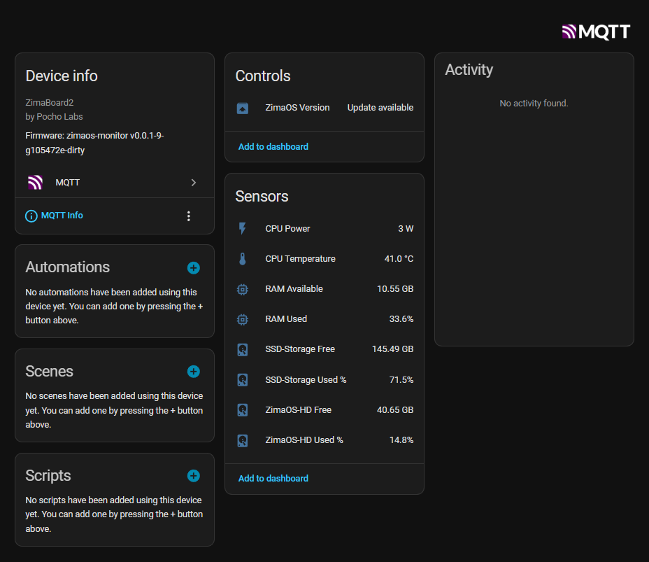
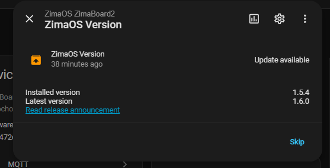
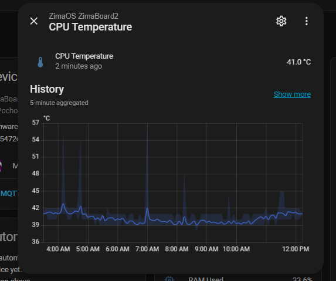

# zimaos-monitor

[](LICENSE)

A Go service for ZimaOS that collects system metrics and publishes them via MQTT with Home Assistant autodiscovery. Works on all ZimaSpace devices: ZimaBoard, ZimaBlade, ZimaCube, and others.

---

## Published Metrics

| Metric | Source | JSON field |
|--------|--------|------------|
| CPU Temperature | `/sys/class/hwmon` (Intel coretemp) | `cpu_temp` (°C) |
| CPU Power | `/sys/class/powercap` (Intel RAPL) | `cpu_watts` (W) |
| RAM Used | gopsutil | `ram_used_pct` (%) |
| RAM Available | gopsutil | `ram_available_gb` (GB) |
| RAM Total | gopsutil | `ram_total_gb` (GB) |
| Disk Used % | gopsutil per mount | `disks[name].used_pct` (%) |
| Disk Free | gopsutil per mount | `disks[name].free_gb` (GB) |
| ZimaOS Version | `/etc/os-release` + GitHub releases | `zimaos.installed_version` / `zimaos.latest_version` |

---

## Configuration (`config.yaml`)

All `device` fields and `disks` are **auto-detected** at startup — a minimal config only needs the MQTT broker:

```yaml
mqtt:
  broker: "tcp://YOUR_MQTT_BROKER_IP:1883"
  username: ""
  password: ""

interval: 30s
```

Auto-detected defaults:

| Field | Source |
|-------|--------|
| `device.id` | Sanitized hostname (e.g. `zimaboard2`) |
| `device.name` | `"ZimaOS <hostname>"` |
| `device.model` | `/sys/class/dmi/id/product_name` (e.g. `ZimaBoard2`) |
| `device.manufacturer` | `"Pocho Labs"` |
| `device.serial_number` | `/sys/class/dmi/id/product_serial` (if available) |
| `disks` | All `/media/*` mounts + `/DATA` → `ZimaOS-HD` |

Override any field in `config.yaml` to customize:

```yaml
device:
  name: "Living Room NAS"
  model: "ZimaCube"

disks:
  - path: "/DATA"
    name: "ZimaOS-HD"
  - path: "/media/SSD-Storage"
    name: "SSD"
```

### `updates` section (optional)

Controls the GitHub upstream version check for the ZimaOS Update entity in HA:

```yaml
updates:
  enabled: true       # default true
  check_interval: 6h  # default 6h; minimum 1h enforced
```

---

## Home Assistant

**Prerequisite:** An MQTT broker must be running and connected to Home Assistant via the [MQTT integration](https://www.home-assistant.io/integrations/mqtt/). The broker address is what you set in `config.yaml` under `mqtt.broker`.

Once running, sensors appear automatically under:

**Settings → Devices & Services → MQTT → Devices → ZimaOS \<hostname\>**

The device card shows:
- CPU Temperature, CPU Power
- RAM Used %, RAM Available
- Per-disk Used % and Free (one entry per `/media/*` mount and `/DATA`)
- **ZimaOS Version** — a native Update entity showing installed vs. latest stable release, with a link to release notes; appears on **Device Info** when a newer version is available. (Check why not appear on **Settings → System → Updates**)



Clicking the update entity shows the installed and latest versions with a link to the release announcement:



Each sensor includes full history tracked by Home Assistant:



---

## MQTT Topics

| Topic | Content |
|-------|---------|
| `<device_id>/state` | JSON payload with all metrics (not retained) |
| `<device_id>/update` | Flat JSON with `installed_version`, `latest_version`, `release_url` for the HA Update entity (not retained) |
| `homeassistant/sensor/<device_id>/+/config` | HA sensor autodiscovery (retained) |
| `homeassistant/update/<device_id>/zimaos_version/config` | HA Update entity autodiscovery (retained) |

On startup, stale retained discovery topics from previous deployments are automatically purged to prevent duplicate sensors in HA.

### Example payload

```json
{
  "cpu_temp": 42.0,
  "cpu_watts": 3.5,
  "ram_used_pct": 28.9,
  "ram_available_gb": 11.4,
  "ram_total_gb": 16.0,
  "disks": {
    "ZimaOS-HD":   { "path": "/DATA",              "used_pct": 12.4, "free_gb": 41.8, "used_gb": 5.6,   "total_gb": 47.4 },
    "SSD-Storage": { "path": "/media/SSD-Storage", "used_pct": 71.5, "free_gb": 145.9, "used_gb": 341.0, "total_gb": 477.0 }
  },
  "zimaos": {
    "installed_version": "1.5.4",
    "latest_version": "1.5.4",
    "release_url": "https://github.com/IceWhaleTech/ZimaOS/releases/tag/1.5.4"
  }
}
```

---

## Build

```bash
make build          # build for current platform
make build-linux    # cross-compile for Linux x86_64 (ZimaOS)
make run-dry        # run locally without MQTT, prints JSON to stdout
make tidy           # go mod tidy
```

---

## Install on ZimaOS

The installer (`scripts/install.sh`) places the binary under `/opt/zimaos-monitor`, installs the systemd unit, and preserves any existing `config.yaml` on upgrade.

### Option A: Download a release (recommended)

SSH into the ZimaOS device and run:

```bash
cd /tmp
TAG=$(curl -sL https://api.github.com/repos/Pocho-Labs/zimaos-monitor/releases/latest | grep '"tag_name"' | cut -d'"' -f4)
curl -LO "https://github.com/Pocho-Labs/zimaos-monitor/releases/download/${TAG}/zimaos-monitor-${TAG}-linux-amd64.tar.gz"
tar -xzf zimaos-monitor-*.tar.gz
cd zimaos-monitor-*-linux-amd64
sudo ./install.sh
```

On **first install** the service is enabled but not started — edit the config first:

```bash
sudo nano /opt/zimaos-monitor/config.yaml
sudo systemctl start zimaos-monitor
sudo journalctl -u zimaos-monitor -f
```

On **upgrade**, `config.yaml` is preserved and the service restarts automatically.

### Option B: Deploy a local build (development)

```bash
# On your dev machine:
make build-linux
scp bin/zimaos-monitor-linux-amd64 \
    config.example.yaml \
    systemd/zimaos-monitor.service \
    scripts/install.sh \
    <user>@<zima-host>:/tmp/

# On the ZimaOS device:
ssh <user>@<zima-host>
cd /tmp && sudo ./install.sh
```

### Uninstall

```bash
sudo systemctl disable --now zimaos-monitor
sudo rm -rf /opt/zimaos-monitor /etc/systemd/system/zimaos-monitor.service
sudo systemctl daemon-reload
```

---

## Technical Notes

- **Intel RAPL** requires `/sys/class/powercap/intel-rapl/`. The service runs as `root`. First metric publish always reports 0 W (no previous delta).
- **Disk discovery** only includes `/media/*` mounts and `/DATA` (mapped to `ZimaOS-HD`), matching exactly what the ZimaOS UI shows.
- **HA autodiscovery** is published with `retained: true` and re-published every 10 intervals to survive HA restarts. Stale topics from prior deployments are purged on startup.
- **Update check** queries `https://api.github.com/repos/IceWhaleTech/ZimaOS/releases` and filters out `-alpha`/`-beta`/`-rc` tags (the repo marks all releases as non-prerelease). Rate limit: 60 req/h unauthenticated — well within the 6 h default interval.

---

## Say thanks

If you find this project useful, consider subscribing to my YouTube channel or following me on X — it really helps!

- 📺 [youtube.com/@PochoLabs](https://youtube.com/@PochoLabs)
- 🐦 [x.com/EzeLibrandi](https://x.com/EzeLibrandi)

---

## Contributing

1. Fork the repository
2. Create a branch: `git checkout -b feature/my-change`
3. Copy `config.example.yaml` → `config.yaml` and configure your device
4. Test with `make run-dry`
5. Open a pull request

## License

MIT — see [LICENSE](LICENSE).
